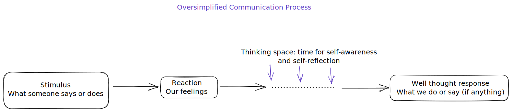

# Thinking gap

How do we think and respond to situations?

Here's a simplified overview of how we process things:

1. **Stimulus**: something happens around us. e.g. someone says or does something
2. **Reaction**: our monkey brain (sometimes the Lizard too) create a feeling
3. **Thinking gap:** Any time from non-existent (0 seconds) to however long we like. Human brain may take over and process. 95% human brain will stay out of the way and we'll get a Monkey brain response.
4. **Response:** what comes out of our mouth, the things we do, or not do.

The goal of effective _conscious_ communication is to train ourselves to expand the thinking gap. The more time we have in the thinking gap, the more opportunities we have to:

1. Interpret the stimulus in different viewpoints.
2. Examine our reaction.
3. **Produce strategies** to respond to get what we want. E.g. meet our needs and needs of others.

**In short: expand the time for Human brain to engage, and engage Human brain in the gap.**

Once we are "in the thinking gap", we have the option to consciously employ many of the tools in this toolkit.
